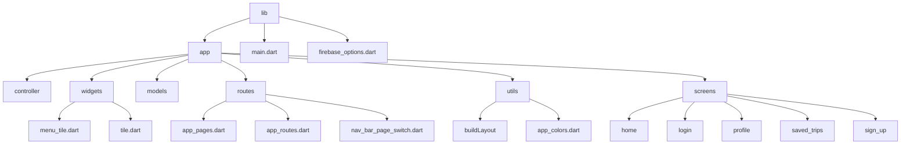
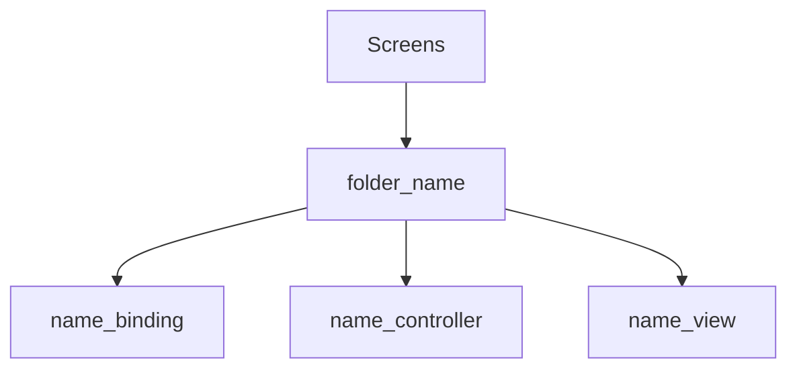

# travellio
-
Following is the app hierarchy (Update as you work):-

```mermaid
graph TD;

  lib --> app;
  lib --> main.dart;
  lib --> firebase_options.dart;

  app --> controller;
  app --> widgets;
  app --> models;
  app --> routes;
  app --> utils;
  app --> screens;

  routes --> app_pages.dart;
  routes --> app_routes.dart;
  routes --> nav_bar_page_switch.dart;

  screens --> home;
  screens --> login;
  screens --> profile;
  screens --> saved_trips;
  screens --> sign_up;

  utils --> buildLayout;
  utils --> app_colors.dart;

  widgets --> menu_tile.dart;
  widgets --> tile.dart;
```

Screens Folder Hierarchy/Template (Stick to this):

```mermaid
graph TD;

Screens-->folder_name-->name_binding;
folder_name-->name_controller;
folder_name-->name_view;
```
